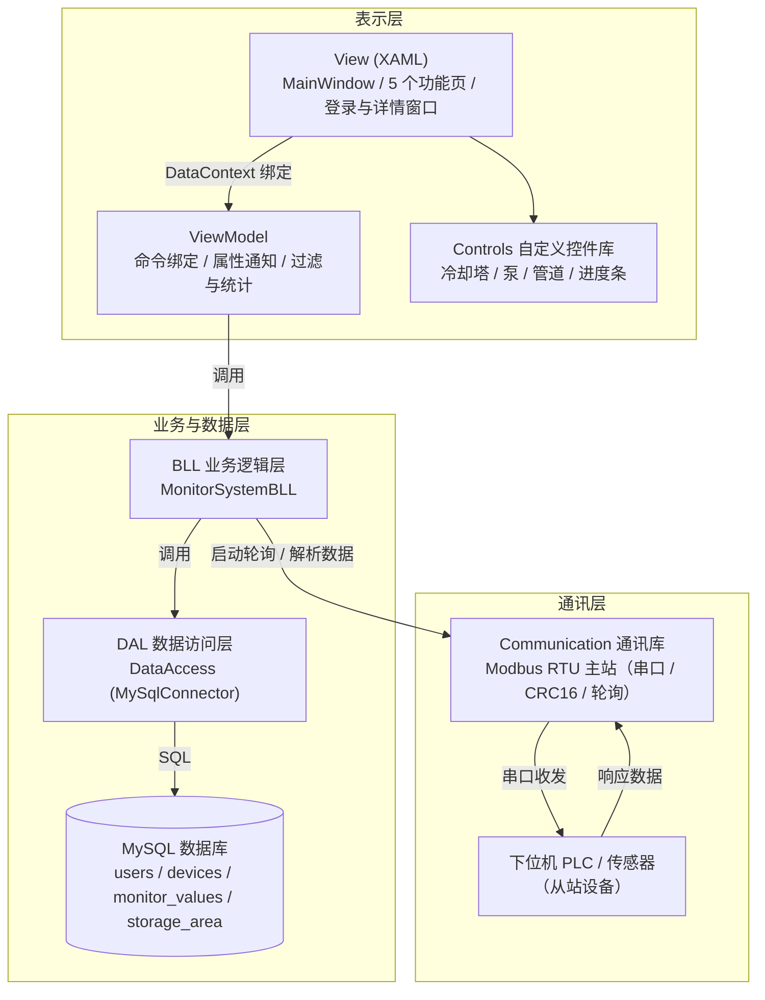

# 科技节能管理系统（MonitoringSystem）项目详解

> 一份用于快速了解本项目、辅助撰写简历的技术说明文档。

---

## 一、项目概述

**科技节能管理系统** 是一套基于 **C# / WPF（.NET Framework 4.8）** 开发的工业现场监控上位机（SCADA 类桌面应用）。系统通过 **Modbus RTU 串口通讯** 实时采集下位机（PLC / 传感器）数据，将设备运行状态、监控点位数值、报警信息以图形化方式展示，并提供用户管理、报表统计、实时曲线等完整功能。

**适用场景**：冷却塔、冷却泵等节能设备的集中监控与运维管理。

**核心价值**：
- 实时采集工业设备数据并可视化展示（设备组态图、实时曲线）
- 四级报警（极低 / 过低 / 过高 / 极高）自动检测与日志记录
- 设备、用户、存储区、串口参数的集中配置管理
- 基于角色的权限控制（管理员 / 普通用户）

---

## 二、技术栈

| 分类 | 技术 / 组件 | 说明 |
|------|------------|------|
| 语言 | C# | 面向对象、async/await、unsafe 指针 |
| 框架 | WPF + XAML | 桌面 UI，MVVM 架构 |
| 目标框架 | .NET Framework 4.8 | 旧式非 SDK 项目 |
| 数据库 | MySQL 8.x | MySqlConnector 2.5.0 驱动 |
| 数据访问 | 三层架构（DAL / BLL / Model） | ADO.NET 风格手动封装 |
| 图表 | LiveCharts 0.9.7（Wpf） | 实时曲线、滑动窗口采样 |
| UI 主题 | MaterialDesignThemes 5.3.2 + 自定义深色主题 | 深色科技风 |
| 通讯 | 自研 Modbus RTU 通讯库 | 串口收发、CRC16、分包轮询 |
| 其他 | System.Drawing（GDI+） | 登录验证码绘制 |

---

## 三、解决方案结构

解决方案 `MonitoringSystem.sln` 包含 **3 个项目**：

```
MonitoringSystem.sln
├── MonitoringSystem/      # 主程序（WPF 启动项目）
│   ├── View/              # 视图（XAML 页面）
│   ├── ViewModel/         # 视图模型（MVVM 的 VM 层）
│   ├── Model/             # 数据模型
│   ├── BLL/               # 业务逻辑层
│   ├── DAL/               # 数据访问层（MySQL）
│   ├── Base/              # 基础设施（通知基类、命令、全局数据、工具）
│   └── Assets/            # 图片、样式、字体资源
├── Controls/              # 自定义控件库（WpfControlLibrary1）
│   ├── ComponentBase.cs   # 控件基类（依赖属性 + 视觉状态）
│   ├── CoolingTower.xaml  # 冷却塔
│   ├── CoolingPump.xaml   # 冷却泵
│   ├── Pinpeline.xaml     # 管道
│   ├── PolygonTower.xaml  # 多边形塔
│   └── CricularProgressBar1.xaml  # 圆形进度条
└── Communication/         # Modbus RTU 通讯库（Communication2）
    ├── Modbus/RTU.cs      # RTU 主站通讯核心
    └── SerialInfo.cs      # 串口参数实体
```

---

## 四、总体架构

采用 **MVVM + 三层架构** 的分层设计：



**分层职责**：

| 层 | 目录 | 职责 |
|----|------|------|
| 表示层 View | `View/` | XAML 页面布局、控件样式、数据绑定 |
| 视图模型 VM | `ViewModel/` | 命令封装、属性变更通知、过滤/统计逻辑 |
| 业务层 BLL | `BLL/` | 业务编排、报警判定回调、数据组装 |
| 数据层 DAL | `DAL/` | MySQL 连接、SQL 执行、参数化查询 |
| 模型 Model | `Model/` | 实体类（继承通知基类） |
| 基础设施 Base | `Base/` | `NotifyPropertyBase`、`CommandBase`、`GlobalMonitor` 全局数据中心、工具类 |

---

## 五、功能模块详解

### 1. 登录系统（`LoginSystem` + `LoginViewModel` + `CaptchaViewModel`）
- 用户名 / 密码 / 图形验证码三项校验
- 验证码由 **GDI+（System.Drawing）** 动态绘制 6 位字符（数字 + 大写字母，排除易混淆字符），点击可刷新
- 密码采用 **MD5 加盐加密**：`MD5(password + "@" + username)`，数据库中不存明文
- 登录时校验账号 `status` 字段，被禁用账号拒绝登录
- 登录成功后写入全局 `GlobalMonitor.CurrentUsername`

### 2. 系统监控（`SystemMonitor` + `SystemMonitorViewModel`）
- 以组态图形式展示设备运行状态（冷却塔、冷却泵、管道等自定义控件）
- 控件支持 **运行 / 停止 / 故障 / 选中** 多种视觉状态切换
- 点击设备弹出设备详情，显示各监控点位实时数值与报警信息

### 3. 实时曲线（`RealTimeCurve` + `RealTimeCurveViewModel`）
- 基于 **LiveCharts** 按设备绘制各监控点位的实时趋势曲线
- 滑动窗口采样：每个点位保留最近 **60 个采样点**（实时曲线）、**3600 个采样点**（历史曲线）
- 支持切换设备、自动重建曲线系列（`SeriesCollection`），多颜色轮换区分点位

### 4. 系统操作（`SystemOperation` + `SystemOperationViewModel`）
- **设备管理**：设备列表 + 监控点位明细展示，运行 / 报警状态徽标
- **用户管理**：用户列表，支持 **启用 / 禁用、删除用户**（管理员权限校验，实时写库并刷新界面）
- **存储区配置**：Modbus 存储区（从站地址、功能码、起始地址、长度）管理
- **串口设置**：端口号 / 波特率 / 数据位 / 校验位 / 停止位配置，保存到 `App.config`

### 5. 报警管理（`AlarmManegerSystem` + `AlarmManegerViewModel`）
- 汇总设备报警状态与报警日志
- 支持按 **设备 / 日志类型（警告、故障）/ 关键字** 过滤查询、刷新、查看详情
- 统计卡片：活动报警数、总报警数、警告数、故障数
- 支持清除报警操作

### 6. 报表管理（`ReportManagement` + `ReportViewModel`）
- 按设备、日志类型、时间范围、关键字多条件查询日志
- 统计汇总：总数 / 信息 / 警告 / 故障数量
- 报表数据导出（CSV / 文件导出）

---

## 六、核心技术点

### 1. Modbus RTU 通讯（`Communication` 项目）
- **主站轮询**：后台任务循环遍历所有存储区配置，逐条下发读取指令
- **功能码支持**：`0x01`（读线圈）、`0x03`（读保持寄存器）
- **CRC16 校验**：实现 Modbus CRC-16（多项式 `0xA001`），保障报文完整性
- **分包读取**：寄存器数量超过 100 时自动分多次读取（单次响应 ≤ 256 字节）
- **异步收发**：`SerialPort.DataReceived` 事件 + 缓冲区拼接，按长度校验后触发 `ResponseData` 回调
- **单例模式**：`RTU.GetInstance()` 保证全局唯一串口实例
- **字节→Float 解析**：用 `unsafe` 指针将 4 字节寄存器数据重新解释为单精度浮点数

### 2. MVVM 架构
- `NotifyPropertyBase`：实现 `INotifyPropertyChanged`，提供 `Set<T>()` 与 `RaisePropertyChanged()`
- `CommandBase`：实现 `ICommand`，封装 Action 委托
- View 通过 `DataContext` 绑定 ViewModel，命令与属性完全解耦

### 3. 三层数据访问
- `DAL/DataAccess`：MySqlConnector 参数化查询（防 SQL 注入），`using` 自动释放连接
- `BLL/MonitorSystemBLL`：业务编排，返回统一的 `DataResult<T>`（State / Message / Data）
- `Model`：实体类，映射数据库表字段

### 4. 报警事件驱动机制
- `MonitorValueModel.CurrentValue` 的 setter 中进行 **四级报警判定**：
  - `LoLo`（极低）、`Low`（过低）、`High`（过高）、`HiHi`（极高）
- 通过委托回调 `ValueStorageChanged` 通知 BLL 更新设备报警状态、写入日志
- BLL 暴露静态事件 `OnNewLogAdded`，各 ViewModel 订阅后实时刷新统计与列表

### 5. 反射式页面导航
- 主窗口用 `RadioButton` 作为导航菜单，`CommandParameter` 传页面类全名
- `MainViewModel.OnTabChaged` 通过 `Type.GetType` + `Activator.CreateInstance` 反射创建 UserControl，动态切换 `MainContent`

### 6. 自定义 WPF 控件库（`Controls` 项目）
- `ComponentBase` 基类定义依赖属性：`IsRunning`、`IsFault`、`IsSelected`、`Command`、`CommandParameter`
- 使用 **VisualStateManager** 实现运行 / 停止 / 故障 / 选中状态的平滑切换
- 支持单击选中互斥（同组控件单选）、命令绑定

### 7. 深色科技风 UI
- MaterialDesign 主题 + 大量自定义 `ControlTemplate`（按钮、下拉框、表格、标签页）
- 内嵌 Noto Sans / Roboto 字体、iconfont 图标字体
- 无边框窗口（`WindowStyle=None` + `AllowsTransparency`），自定义最小化 / 最大化 / 关闭按钮

---

## 七、数据库设计

数据库：`test`（MySQL），连接字符串配置于 `App.config`：

```
Server=localhost;Database=test;Uid=root;Pwd=1234;Port=3306
```

主要数据表（由代码 SQL 与字段映射推断）：

| 表名 | 说明 | 主要字段 |
|------|------|---------|
| `users` | 用户表 | `id`、`user_name`、`password`(MD5)、`status`、`sex`、`create_time`、`updata_time`、`is_admin` |
| `devices` | 设备表 | `d_id`、`d_name`、`is_runing`、`is_warning` |
| `monitor_values` | 监控点位表 | `value_id`、`value_name`、`d_id`、`area_id`、`start_address`、`data_type`、`is_alarm`、`description`、`unit`、`alarm_lolo`、`alarm_low`、`alarm_high`、`alarm_hihi` |
| `storage_area` | Modbus 存储区表 | `id`、`slave_address`、`func_code`、`start_address`、`length` |

---

## 八、关键类速查

| 类 | 位置 | 作用 |
|----|------|------|
| `GlobalMonitor` | `Base/` | 全局静态数据中心（设备 / 用户 / 存储区 / 日志 / 串口信息），启动时初始化 |
| `MainViewModel` | `ViewModel/` | 主窗口 VM：导航、退出登录、个人中心 |
| `MonitorSystemBLL` | `BLL/` | 业务核心：数据初始化、报警回调、用户增删改 |
| `DataAccess` | `DAL/` | MySQL 访问：查询、更新、删除（参数化） |
| `RTU` | `Communication/Modbus/` | Modbus RTU 主站通讯 |
| `MonitorValueModel` | `Model/` | 监控点位：实时值 + 报警判定 + 曲线采样 |
| `DeviceModel` | `Model/` | 设备：运行状态事件 + 点位 + 报警消息集合 |
| `ComponentBase` | `Controls/` | 自定义控件基类 |

---

## 九、简历描述建议（项目经历模板）

> 以下为可直接参考/润色的简历写法，量化数据请按实际情况替换。

### 项目名称
科技节能管理系统（C# / WPF 工业监控上位机）

### 项目描述
基于 WPF 与 Modbus RTU 通讯的工业现场设备监控平台，实时采集下位机 PLC/传感器数据，提供设备组态监控、实时曲线、报警管理、用户权限管理、报表统计等完整功能。

### 主要职责
- 独立完成 **Modbus RTU 通讯模块**：实现主站轮询、CRC16 校验、功能码解析（0x01/0x03）、超长数据分包读取及字节流到浮点数的 unsafe 指针转换
- 搭建 **MVVM 三层架构**（View / ViewModel / BLL / DAL / Model），实现 `NotifyPropertyBase`、`CommandBase` 等基础设施，降低模块耦合
- 设计并实现 **四级报警检测机制**（极低/过低/过高/极高），通过委托回调与静态事件驱动日志记录和界面实时刷新
- 使用 **MySqlConnector** 封装数据访问层，全部采用参数化 SQL 防注入，并实现用户增删改、登录鉴权（MD5 加盐加密 + 图形验证码）
- 基于 **LiveCharts** 实现多设备多点位实时曲线，采用滑动窗口（60/3600 采样点）优化内存
- 开发 **自定义 WPF 控件库**（冷却塔/冷却泵/管道/圆形进度条），利用依赖属性与 VisualStateManager 实现多状态切换与命令绑定
- 基于 MaterialDesign 定制深色科技风主题，重构按钮、表格、下拉框等控件的 ControlTemplate

### 技术关键词
`C#` `WPF` `MVVM` `.NET Framework 4.8` `Modbus RTU` `串口通讯` `CRC16` `MySQL` `MySqlConnector` `LiveCharts` `自定义控件` `多线程/异步` `三层架构` `参数化 SQL` `MD5`

### 可量化亮点（示例，需按实际补充）
- 单轮询周期内并发采集 N 个设备、M 个监控点位
- 报警从检测到界面展示的响应延迟 < X ms
- 支持 N 台设备同时在线监控，历史采样窗口覆盖 1 小时
