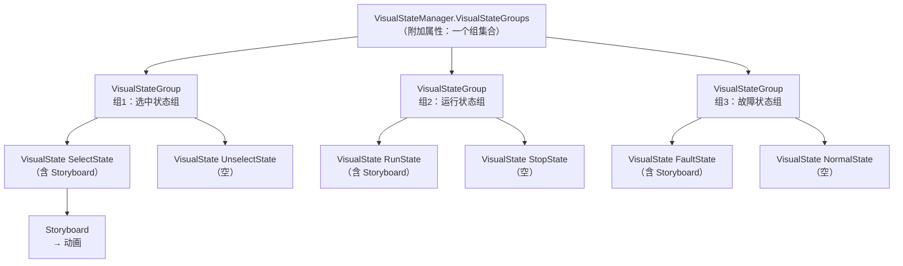
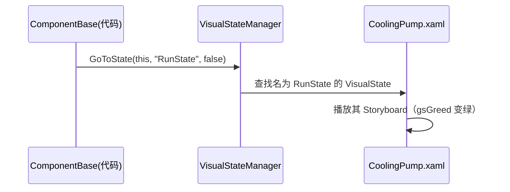

# VisualStateManager 标签详解（面向小白）

> 结合你项目里的 `Controls/CoolingPump.xaml` 逐行讲解 `<VisualStateManager.VisualStateGroups>` 这个标签到底是什么、里面每一层都是干嘛的。

---

## 一、一句话理解

`VisualStateManager`（可视状态管理器）的作用是：**给控件定义几种「外观状态」，当代码切换到某个状态时，自动播放对应的动画。**

比如冷却泵这个控件，有 3 类外观状态：

| 状态类 | 外观 |
|--------|------|
| 选中 / 未选中 | 边框变橙 / 恢复 |
| 运行 / 停止 | 绿灯亮 / 灭 |
| 故障 / 正常 | 红灯闪烁 / 恢复 |

这些「外观 + 动画」就写在 `VisualStateManager` 标签里；而「什么时候切换」由 C# 代码（`ComponentBase.cs`）用 `VisualStateManager.GoToState(...)` 触发。

---

## 二、为什么标签写成 `<VisualStateManager.VisualStateGroups>`（带点）

这是 WPF 的**附加属性（Attached Property）**语法。

- `VisualStateGroups` 本身不是 `VisualStateManager` 的属性，而是它「附加」到别的元素上的一个属性。
- 用 `类型.属性` 这种带点的写法，意思就是：**把 `VisualStateGroups` 这个附加属性，设置到「外层那个元素」身上**。

对照你的文件：

```xml
<Border BorderThickness="1" Name="frame1" Padding="3">
    <VisualStateManager.VisualStateGroups>
        ...
    </VisualStateManager.VisualStateGroups>
    ...
</Border>
```

`<VisualStateManager.VisualStateGroups>` 是 `Border` 的子元素，所以它等于给**这个 `Border`（名叫 `frame1`）**设置了一组可视状态。

> ⚠️ 这一点非常关键，直接决定了动画能不能生效，详见第十节。

---

## 三、整体层级结构



五层结构，从上到下：

```
VisualStateManager.VisualStateGroups   ← 状态组集合（容器）
  └─ VisualStateGroup                  ← 一组「互斥」的状态
       └─ VisualState                  ← 一个具体状态（有名字）
            └─ Storyboard              ← 这个状态要播放的动画
                 └─ 各种动画对象       ← 具体改哪个元素、哪个属性
```

---

## 四、每一层标签逐个详解

### 4.1 `VisualStateGroup` —— 状态组（互斥）

```xml
<VisualStateGroup>
    <VisualState Name="RunState">...</VisualState>
    <VisualState Name="StopState"/>
</VisualStateGroup>
```

- 作用：把**互相排斥**的状态放在一起。一个组里**同一时刻只能有一个状态生效**。
- 比如「运行」和「停止」不能同时发生，所以放同一组。
- 但**组与组之间互不影响**：所以泵可以同时「被选中 + 运行中 + 故障中」，三种效果叠加显示。

### 4.2 `VisualState` —— 状态（必须有名字）

```xml
<VisualState Name="RunState">
```

- 每个状态用 `Name` 起名。
- 这个名字就是 C# 代码里 `GoToState(this, "RunState", false)` 传入的字符串——**必须完全一致（区分大小写）**。
- 里面通常放一个 `Storyboard`（动画）；也可以是空的（表示这个状态下「什么都不做」）。

### 4.3 `Storyboard` —— 动画板

```xml
<Storyboard>
    <ColorAnimationUsingKeyFrames .../>
</Storyboard>
```

- 作用：**容器**，里面装一条或多条动画。当进入这个状态时，`Storyboard` 里的动画会被播放；离开时会被停止并恢复。

### 4.4 两种动画类型（你文件里用到的）

#### ① `ObjectAnimationUsingKeyFrames` —— 一次性替换「对象」

用于改「画笔」这类非数值属性。你的选中状态用它把边框颜色换成橙色：

```xml
<ObjectAnimationUsingKeyFrames Storyboard.TargetName="frame1"
                               Storyboard.TargetProperty="(Border.BorderBrush)">
    <DiscreteObjectKeyFrame KeyTime="0">
        <DiscreteObjectKeyFrame.Value>
            <SolidColorBrush Color="Orange"/>
        </DiscreteObjectKeyFrame.Value>
    </DiscreteObjectKeyFrame>
</ObjectAnimationUsingKeyFrames>
```

- `DiscreteObjectKeyFrame`：离散关键帧，表示「在某个时间点，直接把值设成 X」，不做渐变。
- `KeyTime="0"`：0 时刻（立刻）生效。
- `.Value` 里放目标对象：这里是一个橙色画刷 `SolidColorBrush`。

#### ② `ColorAnimationUsingKeyFrames` —— 按关键帧改「颜色」

用于改 `Color` 值。你的运行/故障状态用它改指示灯颜色：

```xml
<ColorAnimationUsingKeyFrames Storyboard.TargetName="gsGreed" Storyboard.TargetProperty="Color">
    <DiscreteColorKeyFrame Value="Green" KeyTime="0"/>
</ColorAnimationUsingKeyFrames>
```

- `DiscreteColorKeyFrame`：离散颜色关键帧，直接改颜色值。
- `Value="Green"`：改成绿色；`KeyTime="0"`：立刻。

### 4.5 `RepeatBehavior` —— 循环播放

只有故障状态用了它：

```xml
<ColorAnimationUsingKeyFrames RepeatBehavior="Forever"
                              Storyboard.TargetName="gsRed" Storyboard.TargetProperty="Color">
    <DiscreteColorKeyFrame Value="Red"  KeyTime="0:0:0.5"/>
    <DiscreteColorKeyFrame Value="Gray" KeyTime="0:0:1"/>
</ColorAnimationUsingKeyFrames>
```

- `RepeatBehavior="Forever"`：无限循环。
- `KeyTime="0:0:0.5"`：0.5 秒时变红；`KeyTime="0:0:1"`：1 秒时变灰。
- 效果：红灯**红→灰→红→灰…**不停闪烁，模拟报警灯。

### 4.6 `Storyboard.TargetName` 与 `Storyboard.TargetProperty` —— 动画改谁、改什么

这是最关键的两个属性：

| 属性 | 含义 | 你的例子 |
|------|------|---------|
| `TargetName` | 目标元素的名字（`x:Name` 或 `Name`） | `frame1`、`gsGreed`、`gsRed` |
| `TargetProperty` | 要修改该元素的哪个属性 | `(Border.BorderBrush)`、`Color` |

对应到文件里被改的对象：

| 目标名 | 是谁 | 改的属性 | 效果 |
|--------|------|---------|------|
| `frame1` | 最外层 `Border` | `BorderBrush` 边框颜色 | 选中变橙 |
| `gsGreed` | 上方指示灯里的 `GradientStop` | `Color` 颜色 | 运行变绿 |
| `gsRed` | 下方指示灯里的 `GradientStop` | `Color` 颜色 | 故障闪烁 |

> 所以动画不是凭空作用的，而是通过 `TargetName` 找到界面里那个「起了名字」的元素，再改它的 `TargetProperty`。

### 4.7 空的 `VisualState`（如 `UnselectState`、`StopState`、`NormalState`）

```xml
<VisualState Name="UnselectState"/>
```

- 一个「什么都不做」的状态。
- 为什么要写？因为进入别的状态后，动画效果会一直保持；需要一个「空状态」来把外观**恢复默认**。
- 例如从 `RunState`（绿灯）切到 `StopState`（空）时，`Storyboard` 停止，绿灯自动恢复成默认的灰色。

---

## 五、本文件三个状态组的完整对照

| 组 | 状态名 | 进入时做什么 |
|----|--------|-------------|
| 组1 选中 | `SelectState` | `frame1` 边框 → 橙色 |
| | `UnselectState` | 无（恢复默认边框） |
| 组2 运行 | `RunState` | `gsGreed` → 绿色（绿灯亮） |
| | `StopState` | 无（恢复灰色） |
| 组3 故障 | `FaultState` | `gsRed` 红/灰 无限闪烁 |
| | `NormalState` | 无（恢复灰色） |

---

## 六、状态是怎么被触发的？（与 ComponentBase 联动）

`ComponentBase.cs` 里的代码负责喊「切换状态」：

```csharp
// 选中状态切换
VisualStateManager.GoToState(this, value ? "SelectState" : "UnselectState", false);

// 运行状态切换
VisualStateManager.GoToState(d as ComponentBase, state ? "RunState" : "StopState", false);

// 故障状态切换
VisualStateManager.GoToState(d as ComponentBase, state ? "FaultState" : "NormalState", false);
```

`GoToState` 三个参数：

| 参数 | 含义 | 你的值 |
|------|------|--------|
| 第 1 个 | 哪个控件要切状态 | `this`（控件本身） |
| 第 2 个 | 目标状态名（字符串） | `"RunState"` 等 |
| 第 3 个 | 是否播放过渡动画 | `false`（直接切换） |

完整流程：



---

## 七、为什么不直接写 `<VisualStateManager>...</VisualStateManager>`？

因为 `VisualStateManager` 本身是一个「管理器」类，不是一个可见的界面元素。你不能把它当成一个控件放进界面里，而是通过附加属性（`VisualStateManager.VisualStateGroups`）把它「挂」到某个界面上。

对比：

| 写法 | 含义 |
|------|------|
| `<VisualStateManager.VisualStateGroups>` | 给外层元素**附加**一组状态（正确） |
| `<VisualStateManager>` | 把管理器当成元素放进树里（错误，它不是 UI 元素） |

---

## 八、常用相关 API 速查

| API | 作用 |
|-----|------|
| `VisualStateManager.GoToState(element, name, useTransitions)` | 让 `element` 切到 `name` 状态 |
| `VisualStateManager.GoToElementState(stateGroupsRoot, name, useTransitions)` | 同上，但明确指定「状态组挂在哪个元素上」 |
| `VisualStateGroup.CurrentState` | 当前生效的状态 |
| `VisualTransition`（本文件没用） | 两个状态之间的平滑过渡动画 |

---

## 九、关键属性汇总表

| 名称 | 属于谁 | 作用 |
|------|--------|------|
| `Name` | `VisualState` | 状态名，代码靠它找状态 |
| `Storyboard.TargetName` | 动画 | 动画要改的元素名 |
| `Storyboard.TargetProperty` | 动画 | 动画要改的属性 |
| `KeyTime` | 关键帧 | 动画在哪个时间点生效 |
| `RepeatBehavior` | 动画 | 是否循环播放 |

---

## 十、⚠️ 一个必须注意的坑（结合你的文件）

WPF 源码里，`VisualStateManager.GoToState(元素, 状态名, ...)` **只会在「传入的那个元素本身」上查找 `VisualStateGroups`**，它**不会**自动去这个元素的子元素里找。

而你的文件是这样的：

```xml
<local:ComponentBase x:Class="WpfControlLibrary1.CoolingPump" ...>   <!-- ① 这是控件本身 -->
    <Border Name="frame1" ...>                                        <!-- ② 这是子元素 -->
        <VisualStateManager.VisualStateGroups> ... </VisualStateManager.VisualStateGroups>  <!-- 状态组挂在了 Border 上 -->
    </Border>
</local:ComponentBase>
```

但代码里是：

```csharp
// ComponentBase.cs 里
VisualStateManager.GoToState(this, "RunState", false);
//                         ↑ this = 控件本身（ComponentBase / CoolingPump）
```

**状态组挂在 `Border` 上，代码却对「控件本身」喊 GoToState——两者不是同一个元素，因此动画很可能不会触发。**

### 修复方式（二选一）

**方式一（推荐）：把状态组移到控件根元素上**

```xml
<local:ComponentBase x:Class="WpfControlLibrary1.CoolingPump" ...>
    <VisualStateManager.VisualStateGroups>
        <!-- 三个 VisualStateGroup 原样搬到这里 -->
    </VisualStateManager.VisualStateGroups>
    <Border BorderThickness="1" Name="frame1" Padding="3">
        <Viewbox ...>...</Viewbox>
    </Border>
</local:ComponentBase>
```

这样状态组就挂在了 `GoToState(this, ...)` 传入的控件本身，动画正常生效。

**方式二：改用 `GoToElementState`，明确指定状态组所在元素**

```csharp
// 在 ComponentBase 里，把 GoToState 改成 GoToElementState，并传入 frame1
VisualStateManager.GoToElementState(frame1, "RunState", false);
```

但因为 `frame1` 是子控件里起的名字，基类 `ComponentBase` 并不直接持有它，所以**方式一更通用、更推荐**。

> 如果你在实际运行中发现「选中边框不变橙、绿灯不亮、红灯不闪」，原因基本就是这个位置错配。

---

## 十一、小结

1. `<VisualStateManager.VisualStateGroups>` 是**附加属性**，表示「给外层元素挂一组可视状态」。
2. 五层结构：`VisualStateGroups` → `VisualStateGroup`（互斥组）→ `VisualState`（具名状态）→ `Storyboard`（动画板）→ 动画对象。
3. 动画靠 `TargetName` + `TargetProperty` 定位到具体元素和属性去修改。
4. 代码用 `GoToState(元素, 状态名, false)` 触发状态切换，**状态名必须与 XAML 里的 `Name` 完全一致**。
5. **状态组必须挂在 `GoToState` 传入的那个元素上**（或模板根），否则动画不会生效——这是你当前文件里最需要留意的一点。
